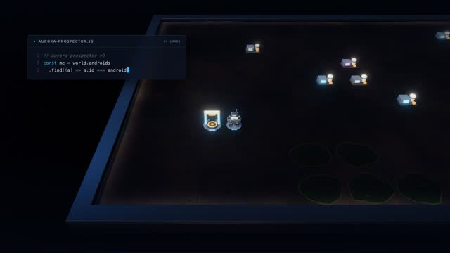
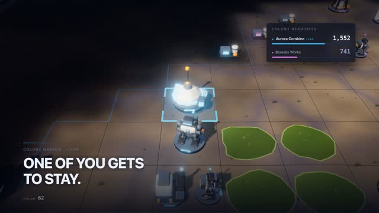
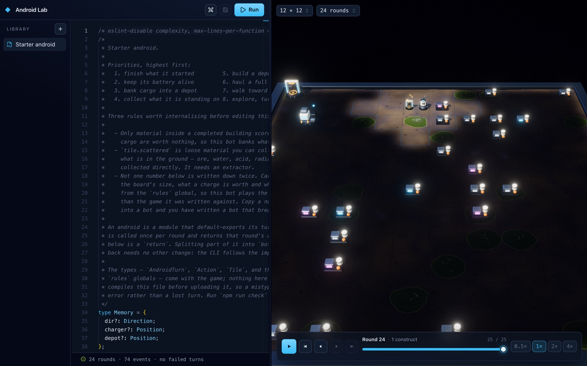
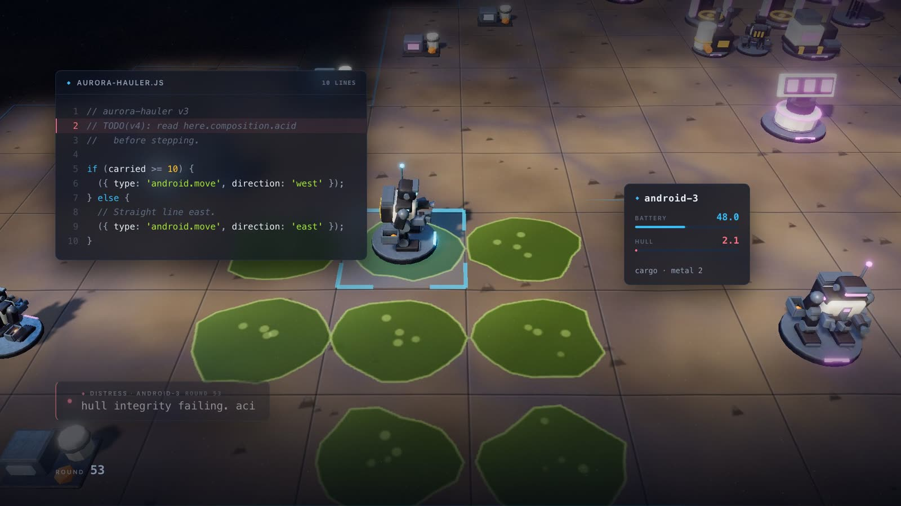

# Project: Nova

**Use coding agents to program the machines that will decide humanity’s next home.**

| First light                                                 | The colony module                                  | The browser lab                                    |
| ----------------------------------------------------------- | -------------------------------------------------- | -------------------------------------------------- |
|                    |         |                    |
| One android, one charger, and a board nobody has looked at. | 1,000 readiness points, and the game's hero piece. | Your script on the left, what it did on the right. |

**[▶ Watch the 81-second trailer](docs/media/nova-trailer-preview.mp4)** · **[Try it in the browser](https://morten-olsen.github.io/nova/ide/)** · **[Read the rules](./docs/RULEBOOK.md)**

Humanity found a planet worth crossing the void for: resource-rich, unexplored, and hostile to anything with lungs. The colony fleet launched anyway. It arrives whether or not the ground is ready for it.

Nobody can land into acid flats and open radiation, so the machines go first. Androids drop ahead of the fleet with a charger, a battery and no supervision — and everything they will ever know how to do has to be aboard them before they wake up.

That is your job. You never move an android or click a unit. You write the program it runs, launch it, and read back what it actually did: where it walked into acid, where it ran flat two tiles from a charger, where it built the depot in the wrong place. Then you write a better one.

Three rules make that a game:

- **One action per round.** Each android runs your script once a round and returns a single action — move, collect, build, salvage, broadcast. That is the whole interface between you and the planet.
- **Nobody is at the controls.** Once a run starts you cannot intervene. Whatever your script does about acid, battery and cargo, it does alone.
- **Every round is on the record.** A game is an event recording. Replay it, scrub to the round it went wrong, and you are looking at the exact decision your code made and the world it made it in.

## What you actually write

An android is a TypeScript module that default-exports its turn function. It gets the world as it can see it, and returns one action:

```ts
export default () => {
  const android = world.androids.find((candidate) => candidate.id === androidId);

  if (!android) {
    return { type: 'android.wait' };
  }

  return { type: 'android.move', direction: 'east' };
};
```

That script is not impressive, and that is the point. Your first android is dumb. Then it is a scavenger, then a builder, then a logistician, then a hazard-cleanup specialist, then part of a colony program that can respond to a rival.

You are not expected to hand-write a perfect android brain from scratch. Nova is built for a world where players work with coding agents: describe the behaviour you want, have an agent implement it, run the simulation, inspect the failure, and ask for a better version. A coding agent can write the android. It cannot decide what kind of colony program you are trying to build.

## Trailer

[](docs/media/nova-trailer-preview.mp4)

**[▶ Watch the trailer (81s, with sound)](docs/media/nova-trailer-preview.mp4)**

Two runs. First light: one android, one charger, and a board nobody has looked at yet. Then a colony program that has grown into an industry — extractors working the ground, a corridor of depots, a colony module going up while the readiness score climbs. And a hauler running version three of a script whose routing never learned to read `composition.acid`, walking east across the flats. Its last broadcast outlives it.

<details>
<summary>Not a mock-up — how the trailer was made</summary>

Both acts are ordinary Nova recordings — [`trailer-first-light.json`](examples/games/trailer-first-light.json) and [`trailer-colony-race.json`](examples/games/trailer-colony-race.json), the same files the replay viewer opens — played back through the game's own renderer one frame at a time. The script in the code panel is the script stored in the recording, and the readiness numbers come from the same scoring function `nova status` uses. Built with [`apps/trailer`](apps/trailer/README.md).

The two shots at the top of this file are frames of it, and so is the banner above.

</details>

<!--
  The banner links to the video. For an inline player instead, open this file in
  the GitHub web editor and drag `docs/media/nova-trailer-preview.mp4` in: GitHub
  stores it as an attachment and inserts a `user-attachments` URL, which renders
  as a player. A committed file referenced by relative path only ever links. The
  preview is 4MB — inside GitHub's 10MB video limit even on a free plan, so it
  does not need Git LFS.
-->

## Quick start

You need Node.js 24 or newer. Run the initializer from the directory where you want your android factory to live:

```sh
npx -p @morten-olsen/nova nova init
```

Nova asks for a folder name (or take it from `nova init my-android-factory`), creates it, installs the Nova packages, and writes:

- `bot/starter-builder.ts` — a safe first android to modify
- `tsconfig.json` — points TypeScript at the game's own types, so `world` and every action are typed without an import
- `AGENTS.md` — instructions for a coding agent working in the factory
- `docs/` — the rulebook, the CLI guide, and the android builder manual

Then run the starter android:

```sh
cd my-android-factory
npx nova create-game --file game.json --width 8 --height 8
npx nova upload-script --file game.json --owner player-1 --name starter-builder --script bot/starter-builder.ts
npx nova launch-android --file game.json --owner player-1 --script-id script-1
npx nova run --file game.json --rounds 10
npx nova status --file game.json
npx nova play --file game.json
```

`nova status` reports every android, its battery and location, and the colony-readiness score with its contributors. `nova play` opens the recording in the replay viewer in your browser — nothing is uploaded — so you can watch the round where it went wrong; press Ctrl+C when you are done.

Now open the factory in your coding agent, ask it to read `AGENTS.md`, and have it improve `bot/starter-builder.ts`. Make one change, upload it as a new script version, run a short batch, and let the recording decide whether the change stays.

Prefer not to install anything? The [browser IDE](https://morten-olsen.github.io/nova/ide/) has an editor, the sandbox and the board on one page, and your scripts stay in your browser.

### Play against another player

When your android can hold its own, match it against someone else's over a peer-to-peer connection. One player hosts and shares the invite code that is printed:

```sh
npx nova host --script bot/starter-builder.ts --rounds 20 --disclosure full
npx nova join YF4D4-MGZKE --script bot/starter-builder.ts
```

The joining player sees the terms — host, rounds, world size, and disclosure mode — and accepts before anything is sent. The host runs the simulation for both androids and picks what evidence both players keep afterwards:

- `--disclosure full` gives both players a replayable recording of the whole match. Script source and the other android's `memory` and `recording` are redacted: what it did is disclosed, how it decided is not.
- `--disclosure recording` gives each player only what their own android wrote to its `recording` field, plus the final scores.

That second mode is where the game gets interesting. With no replay to fall back on, whatever your android wrote down is your only account of what happened — so what it chooses to record becomes part of its design. See the [CLI guide](./docs/CLI-GUIDE.md#play-another-player) for the details.

Because the host executes both scripts, only host a match with someone whose code you are willing to run.

### Keep a factory current

```sh
npx -p @morten-olsen/nova nova update
```

Pins the Nova packages to the exact version of the CLI being run, reinstalls, and refreshes `docs/`. Your androids in `bot/` are untouched.

## Where the game goes

The rulebook's phases blend into each other rather than gating; they are really three problems.

1. **Scavenge.** Find the material Earth scattered, carry what fits, and get back to the charger before the battery runs out. Collection becomes a logistics problem the moment a depot is worth building, and chargers are what set how many androids you can have at all.
2. **Produce.** Loose material runs out. Extractors work the ground itself, processors turn ore into metal, and an acid plant lets your androids start cleaning a planet that is trying to dissolve them.
3. **Contest.** There is one colony claim. Broadcasts are public and nothing stops them being false, salvage works on infrastructure that is not yours, and no rule enforces an alliance you agree to.

The interesting questions arrive with the second phase and never leave: where the first real base goes, which chargers are worth defending, when a depot becomes a hub, whether acid is a hazard or a boundary you can use, what is safe to broadcast, and when helping a rival stop the leader becomes a risk of its own.

## Project status

Nova is early, local-first, and actively evolving. Today's ruleset already supports a full automation loop: exploring a randomized tile world, collecting scattered material under cargo and battery limits, building chargers, depots, extractors, processors, scanners, radars, acid processing plants and colony modules, extracting from tile composition, processing ore into metal, broadcasting public messages, salvaging buildings including hostile ones, taking damage from acid and radiation, and cleaning adjacent acid once a plant is up.

Around that: a TypeScript simulation engine, event-based recordings, a CLI for creating and inspecting games, a browser replay viewer and IDE, example scripts and sample recordings, and peer-to-peer two-player matches with host-chosen disclosure.

Readiness scoring is live: `nova status` and the replay viewer report it per player with a contributor breakdown, and a completed colony module is worth 1,000 — more than everything else on the board put together. What it does not do yet is end anything. The fleet-arrival endgame that turns a readiness score into a winner is still to come, along with restricted competitive fog-of-war, matches beyond two players, and direct combat or defensive systems. The relay tower is the one piece you can build today that has no mechanic behind it.

Every cost, construction time and yield is a rule rather than a constant, and a game created with `--rules` hands your android the numbers it is actually playing under — so a program that reads them keeps working when the game is tuned.

## Documentation

Player and builder documents ship into every factory and are also rendered on [the site](https://morten-olsen.github.io/nova/docs/):

- [Rulebook](./docs/RULEBOOK.md) — the player-facing rules and the action API
- [CLI guide](./docs/CLI-GUIDE.md) — creating, running, inspecting and hosting games
- [Android builder manual](./docs/ANDROID-BUILDER-MANUAL.md) — evolving an android past its first version

For working on Nova itself:

- [Visual design language](./docs/visual-design.md)
- [Adding a building](./docs/ADDING-BUILDINGS.md)
- [Programmatic playback](./docs/PROGRAMMATIC-PLAYBACK.md)

## Working on Nova itself

Install dependencies, then generate and run a sample game from the repository:

```sh
pnpm install
pnpm nova create-game --file game.json --width 6 --height 6
pnpm nova upload-script --file game.json --owner player-1 --name starter-builder --script docs/examples/starter-builder.ts
pnpm nova launch-android --file game.json --owner player-1 --script-id script-1
pnpm nova run --file game.json --rounds 35
pnpm nova status --file game.json
```

There is a committed sample recording at `examples/games/starter-builder-sample.json`. Run `pnpm dev:web` to launch the visualizer, then `pnpm nova play --file examples/games/starter-builder-sample.json` to scrub through its event history.

## Long-term vision

The destination is a shared programming strategy game where multiple players deploy autonomous androids to the same hostile planet. The winner will not be the player with the most units or the fastest scavenger. It will be the player whose android program best turns a hostile world into a viable human foothold: infrastructure, logistics, production, exploration, environmental cleanup, public signaling, sabotage resistance, and timely pressure against rivals.

Build the machines. Run the world. Study the failures. Ask your coding agent for better behavior. Launch again.
