# Nova piece previews

Generated 512 × 512 renders for reviewing the starter tabletop set without opening Blender. Regenerate all previews and GLBs from the repository root:

```sh
blender --background --python packages/renderer/blender/scripts/generate-nova-pieces.py
```

| Android                   | Charger                   | Depot                 |
| ------------------------- | ------------------------- | --------------------- |
| 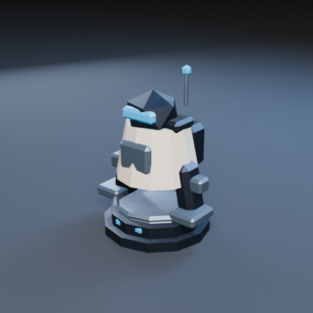 | 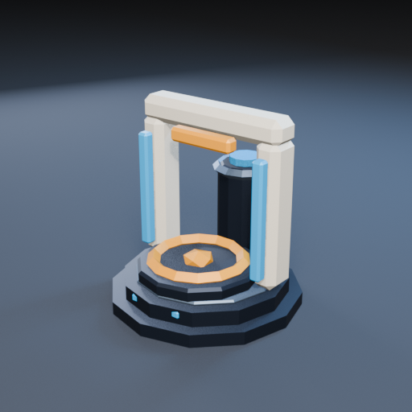 | 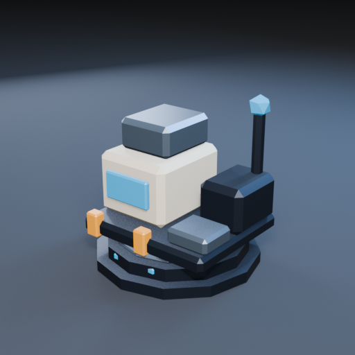 |

| Extractor                     | Processor                     | Acid processing plant                                 |
| ----------------------------- | ----------------------------- | ----------------------------------------------------- |
| 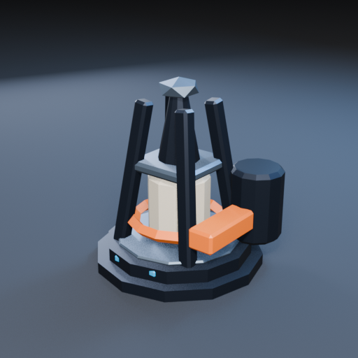 | 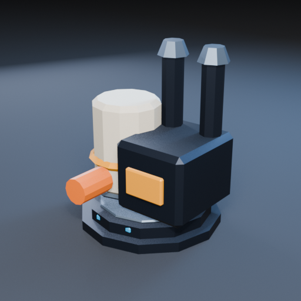 | 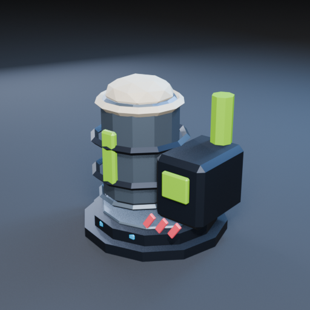 |

| Relay tower                       | Scanner                   | Colony module                         |
| --------------------------------- | ------------------------- | ------------------------------------- |
| 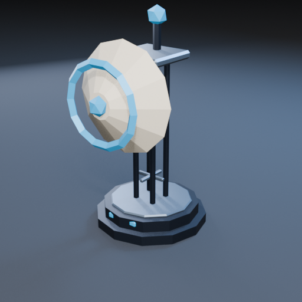 | 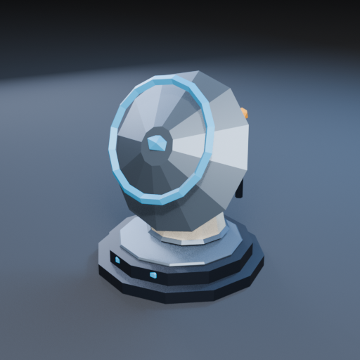 | 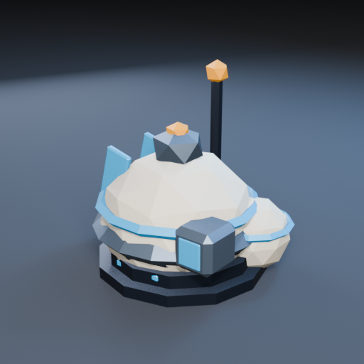 |

| Radar                 | Loose material cache                          |
| --------------------- | --------------------------------------------- |
| 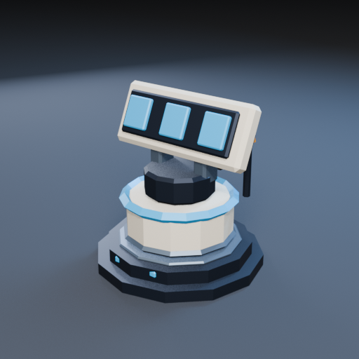 | 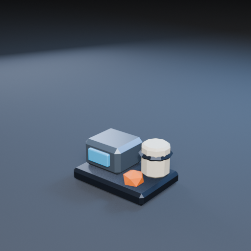 |
